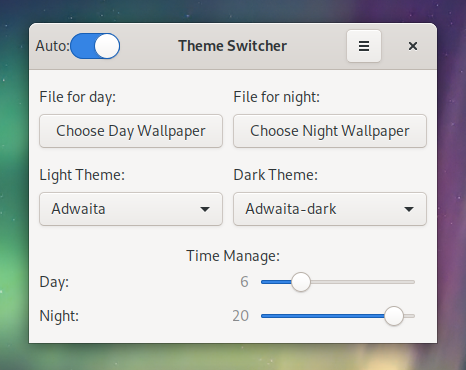

# theme-switcher

A global automated switcher for dark/light GTK theme during day/night and more.

Theme-switcher automatically can switch your:

- GTK theme
- GNOME Terminal profiles
- Wallpapers
- More will come...

<div style="text-align: center;"></div>

### Prerequisites for building from source

```sh
sudo dnf install python3-gobject gtk3
sudo cp com.github.Latesil.theme-switcher.gschema.xml /usr/share/glib-2.0/schemas/
sudo glib-compile-schemas /usr/share/glib-2.0/schemas/
```

### Install

Fedora [COPR](https://copr.fedorainfracloud.org/coprs/atim/theme-switcher/): `sudo dnf copr enable atim/theme-switcher -y && sudo dnf install theme-switcher -y`

### Run GUI version:

```sh
theme-switcher-gui.py
```

### Run CLI version

#### Automatically

- Enable: `systemctl --user enable --now theme-switcher-auto.timer`

- Disable: `systemctl --user disable --now theme-switcher-auto.timer`

#### Manually:

```sh
theme-switcher-manual.sh
```

### Configure

You need to setup your light/dark profiles in gnome-terminal in order to switch terminal themes automatically. Configure them by edit:

```sh
sudoedit /usr/bin/theme-switcher-auto.sh
```
